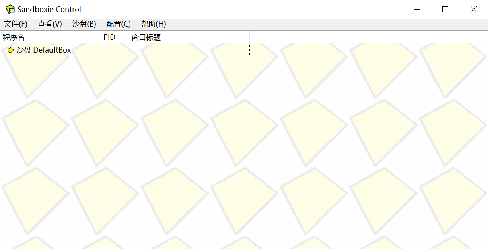
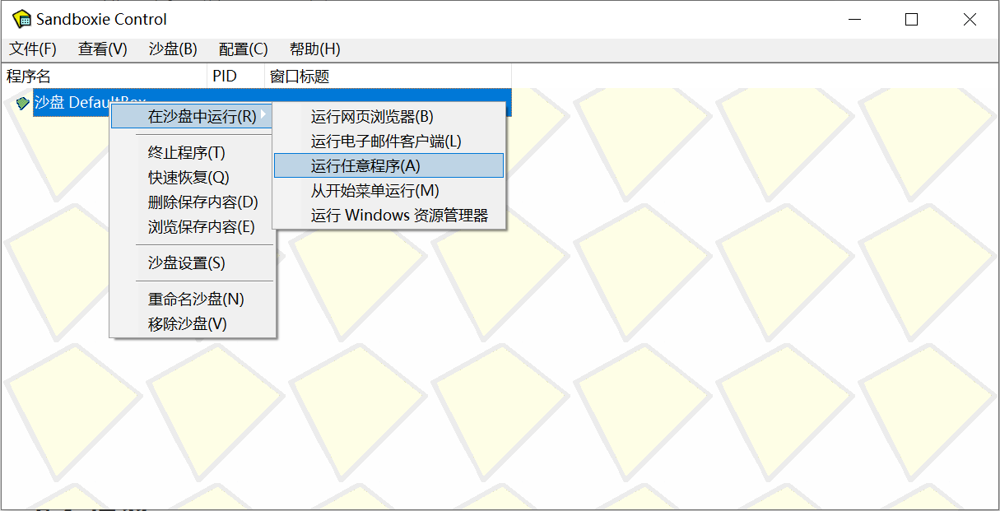

高级说明
----------

.. hint::
    前面的使用方法已经足够脚本的日常使用，如果只是刷刷本，这一章节可以略过。

源码运行入口
+++++++++++++

获取源码的朋友可能会疑惑如何运行。

本脚本的源码运行入口只有一个，就是Onmyoji.py，没有图形界面。所有的运行参数都是从conf.ini中读取。参数的说明可以参考conf_example.ini。如果你觉得参数的手动编辑太麻烦，可以运行ui.py生成。

在release中的两个可执行文件ui.exe和Core.exe，是ui.py和onmyoji.py分别使用pyinstaller编译生成的。但由于不明原因ui.exe会被windows defender报毒，我自己用Avast和腾讯哈勃系统检测均没有风险，应该是误报。

ui.py文件的主要功能在于生成配置文件，然后调用系统cmd运行Core.exe。因此单独运行会提示缺少Core.exe文件。

bug提交和咨询
+++++++++++++

程序总会有bug，本工具也不例外。

本工具具有一定的运行记录能力，运行的日志会生成在log.log文件夹中，采取新日志覆盖旧日志的模式。当发生异常时，为了保护玩家的加成，工具会自动退出阴阳师游戏（默认参数下），并把退出前的阴阳师截图保存至/img/screenshots文件夹中，以日期命名。结合log.log和运行截图，基本可以推测出问题所在。

由于本人时间有限，处于弃坑状态，没法及时测试。如果发现有异常退出的问题，可以提交issues。此外，我在工具中留了交流Q群，但并不时时刻刻检查消息。如果有问题也可以在那上面提出来，记得@一下。

防封
+++++++++++++

.. warning::
    1.0.1.0224以前有些bug会导致封号，在后续版本中已经更新。但仍然可能存在使用风险。

防封主要依靠随机+延迟实现，自带延迟参数很保守。有时候并不是脚本反应慢，而是延迟高。

现在已经在 ``菜单`` - ``高级`` - ``自定义延迟`` 开放了延迟设定，请酌情考虑。设定只需要执行一次，重启有效。设置值保存在生成的 ``delay.json`` 中，而不在于 ``UI`` 的界面中。具体说明可以看里面的说明。

[沙盒运行]
^^^^^^^^^^^

为了进一步加强防封效果， 个人建议使用沙盒运行阴阳师客户端，这样可以有效防止客户端检测进程（脑补）。
以下是关于沙盒软件的介绍。

    *“沙盘是一种安全软件，可以将一个程序放入沙盘运行，这样它所创建修改删除的所有文件和注册表都会被虚拟化重定向，
    也就是说所有操作都是虚拟的，真实的文件和注册表不会被改动。”*

    *“同时，据我了解某些游戏的防护机制是需要管理权限的，在没有管理权限的情况下，用得更安心。”*

沙盒软件我推荐Sandboxie，免费、小巧且开源，然后把游戏客户端放至沙盒中运行。

右键默认的沙盒，做以下改动。

.. image:: ../imgs/sandboxie_setting.png
    :width: 600 px
    :align: center

* ``外观`` 选项卡， **取消勾选** 不要在窗口标题中显示Sandboxie标志。
* ``限制`` - ``降低权限`` 选项卡， **勾选** 降低管理员和超级用户组的权限。

下来，我们就可以启动游戏了，在默认沙盘上右键，选择游戏运行的路径，启动即可。

如果需要双开，则再 ``创建新沙盘`` ，重复上述动作就行。

**请记住：能力越大，责任越大，死的越惨。**

协议
++++++

本工具主要用于学习交流, 使用后果请自行承担。